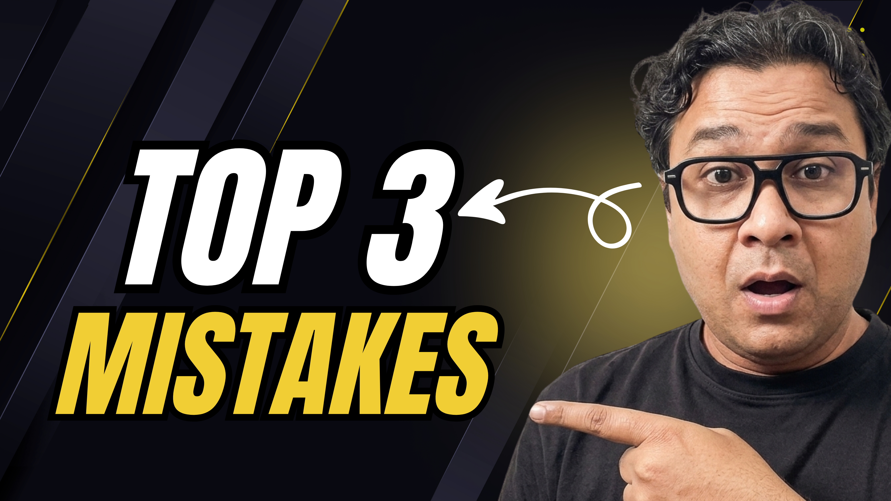

# 3-Idiots 🤡

You will often find the interview questions on React component's race conditions, derrived state, and dependencies.

Let's understand the `3-Idiots` problem.

## The Problem Statement

- How and Why to avoid derrived state?
- How to avoid race condition?
- How to handle non-primitives as useEffect dependencies?

## Solution

Here is the full length video explains the solution:

